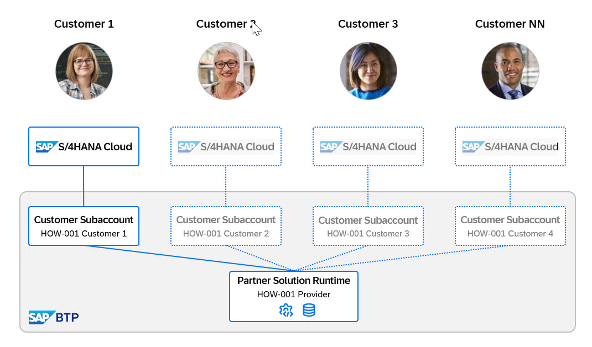

# Getting Started

This chapter introduces the system landscape of this hands-on session. You explore:
- The SAP BTP provider subaccount where the base application **Poetry Slam Manager** is deployed
- The customer's SAP BTP subaccount
- The development environment

## Preparation for the Exercises

During the exercises, you're asked to note some values that are required in later steps. Enter them into the Notes.properties file mentioned below so they're available when you need them. We also recommend constructing required statements in the file.

1. Download the [Notes.properties](./Notes.properties) file to your laptop.
    1. You can use the file to save important SAP BTP subaccount information. This helps you easily build console commands in later deployment steps.
2. Open the file in Visual Studio Code (or any other code editor) on your laptop.

## Get an Overview of the System Landscape

After completing below steps, you have an overview of the system landscape of this hands-on session. The image below provides a visual representation of the landscape.

- There is one [SAP BTP global account](https://emea.cockpit.btp.cloud.sap/cockpit/?idp=aywjhejac.accounts.ondemand.com#/globalaccount/b3eb37fc-460b-48ac-9768-6b5b419b389c) that illustrates the partner global account.
- In this account, you can see a directory called *HOW-nn*.
- Within the directory, a provider subaccount called *HOW-nn PROVIDER* is created.
- Additionally, there is a subaccount called *HOW-nn CUSTOMER 1*.
- The customer subaccount integrates the same SAP S/4HANA Cloud Public Edition system.

## Get an Overview of the SAP BTP Provider Subaccount

After you complete the following steps, you have an overview of the SAP BTP provider subaccount.

1. Open the provider subaccount ([*HOW-nn PROVIDER*](https://emea.cockpit.btp.cloud.sap/cockpit/?idp=aywjhejac.accounts.ondemand.com#/globalaccount/b3eb37fc-460b-48ac-9768-6b5b419b389c)) in the SAP BTP cockpit.
2. Navigate to **Services -> Instances and Subscriptions**.
    - After the Partner Reference Application is deployed, all your subscriptions and instances appear here.
    - The Business Application Studio is already visible under your subscriptions.
3. Navigate to **Connectivity -> Destinations**.
    - After deployment, the destinations for the ERP integration and SAP Build Work Zone appear here.
      
> Note: The [bill of materials](https://github.com/SAP-samples/partner-reference-application/blob/main/Tutorials/01-BillOfMaterials.md) for the Partner Reference Application describes the provider subaccount configuration in more detail.

## Get an Overview of the SAP BTP Subaccount of Your Customer

After you complete the following steps, you have an overview of your customer's SAP BTP provider subaccount.

1. Switch to the SAP BTP subaccount of your customer (*HOW-nn CUSTOMER 1*).
2. Navigate to **Services -> Instances and Subscriptions**.
3. View the instances and subscriptions. 
     1. The application subscriptions are currently empty. Later, you add the deployed **Poetry Slam Manager** app from your provider subaccount.
4. Navigate to **Connectivity -> Destinations**.
    1. Later, you add the destination for SAP Build Work Zone and the SAP S/4HANA Cloud Public Edition here.
5. Navigate to **Overview**.
6. In the **General** section, the **Subdomain** is shown. The subdomain is a specific namespace used to identify and access a subaccount within the SAP BTP platform. Note the **Subdomain** (either for the first or second customer subaccount) to the **CustomerSubdomain** entry in your Notes.properties file. You need it in later steps.

## Summary

Now that you have an overview of the SAP BTP subaccounts, continue with [preparing your provider subaccount for development](./../ex1/1.1-Prepare-BTP-Account-for-dev.md) to develop your multi-tenant application.
