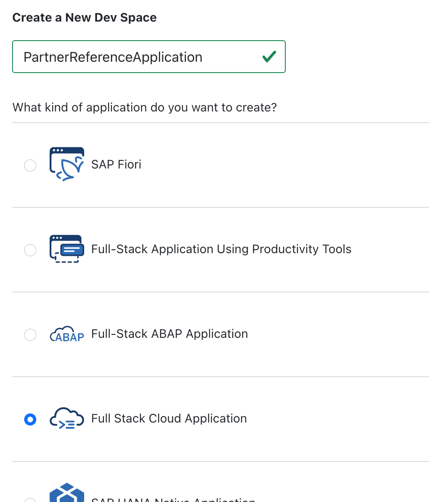

# Prepare Your SAP BTP Account for Development

## Prerequisites 

To start with this tutorial, you need an SAP BTP global account for development.

## Access SAP Business Application Studio

1. Go to your SAP BTP [global account cockpit](https://emea.cockpit.btp.cloud.sap/cockpit/?idp=aywjhejac.accounts.ondemand.com#/globalaccount/b3eb37fc-460b-48ac-9768-6b5b419b389c).
2. Open your provider subaccount named *HOW-nn Provider*.
3. Navigate to **Instances and Subscriptions**.
4. Under **Subscriptions**, open the **Business Application Studio**.
5. In SAP Build, select Dev Space Manager by choosing the **Product Switch** button on the top right.
    1. A new browser tab with the **Business Application Studio** opens.
    2. Choose **Create Dev Space**.
    3. Select **Full Stack Cloud Application** and name it `PartnerReferenceApplication`.
    4. Choose **Create Dev Space**.
6. When the dev space is running, open it.

    

    > Note: When you first start SAP Business Application Studio, access might be denied because user roles haven't been assigned to this service instance yet. To assign them:
    > 1. Navigate to **Security -> Users**.
    > 2. Select your user and go to the assigned **Role Collections**.
    > 3. Select all the role collections for **SAP Business Application Studio** and confirm the assignment.
    >
    > If access is still denied, clear your browser cache.

# Conclusion

Now that your development environment is set up, [start developing the core application](./1.2-Develop-Core-Application.md).
