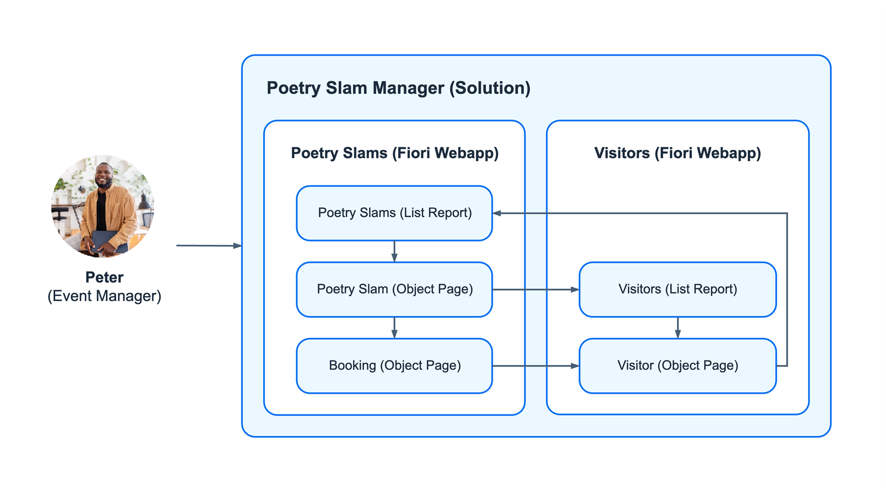
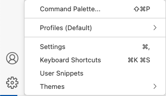
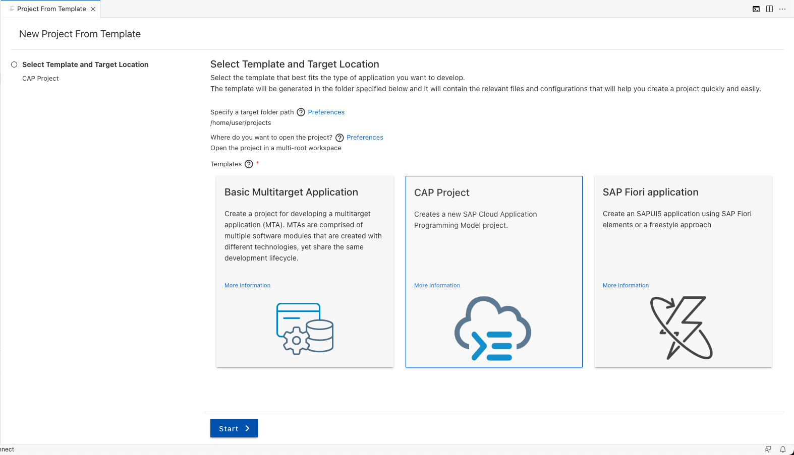

# Develop the Domain Model and the Business Logic with SAP Cloud Application Programming Model

The Partner Reference Application is defined as the business solution *Poetry Slam Manager*. The applications *Poetry Slams* and *Visitors* belong to the business solution and are implemented as SAP Fiori elements apps, each with their own SAP Cloud Application Programming Model service.

<p align="center">
    
</p>

## Create a New Project Based on SAP Cloud Application Programming Model
1. To start a new development project, go to the settings in SAP Business Application Studio and open the *Command Palette...* or press CTRL + SHIFT + P for Windows and COMMAND + SHIFT + P for Mac.

   

2. Search for `Open Template Wizard`.

3. Create a new SAP Cloud Application Programming Model (CAP) project. Make sure the target folder path is set to `home/user/projects`.

   

4. Add the following attributes to the SAP Cloud Application Programming Model (CAP) project:
    - As *project name*, enter `partner-reference-application`.
    - Select `Node.js` as your *runtime*.
    - As *database for your application*, choose *SAP HANA Cloud*.
    - For the deployment, select *Cloud Foundry: MTA Deployment* and *Multitenancy*.
    - As *productive runtime capabilities*, select *SAP BTP Authorization and Trust Management Service (XSUAA)*, *SAP BTP Application Router*, *SAP BTP Destination Service*, and *SAP BTP HTML5 Application Repository*.

    As a result, a folder called `partner-reference-application` is created, which includes a set of files to start an SAP Cloud Application Programming Model project.

## Define the Domain Models

The domain model represents the relational database model of the application. All entities (tables), their relations (associations), and additional metadata (annotations) are maintained in the domain model.

Following the SAP Cloud Application Programming Model, all domain models must be stored in the */db/data/* folder of the project. You create a new file [*/db/poetrySlamManagerModel.cds*](../../../multi-tenant/db/poetrySlamManagerModel.cds).

1. Copy the [domain model entity definitions](../../../multi-tenant/db/poetrySlamManagerModel.cds) into your projects */db/poetrySlamManagerModel.cds* file.

2. As foreign key constraints are enabled by the annotation *@assert.integrity*, add the parameter also to the [root package.json](../../../multi-tenant/package.json). 

```json
  "cds": {
    "features": {
      "assert_integrity": "db"
    }
  }
```

## Reuse Common Content
The modelled entities contain attributes, such as currencies, which are common for typical business applications.

The following steps are required to use the module in the project:

1. Add the node module executing the command below in a terminal of your SAP Business Application Studio. Check that it was added as a dependency to [*package.json*](../../../multi-tenant/package.json).
```
npm add @sap/cds-common-content
```
2. Install the node module with command `npm install`.
3. Import the module in the CDS definition. This was already done in the sample file [*poetrySlamManagerModel.cds*](../../../multi-tenant/db/poetrySlamManagerModel.cds) with code line `using from '@sap/cds-common-content';`

## Create an Initial Data Set

Create an initial data set which will be available after you've started the application.

Copy the [initial data sets](../../../multi-tenant/db/data/) into your projects */db/data* folder.
You can do this by:
- Creating the required files under [*db/data/]*(../../../multi-tenant/db/data/).
- After that copy the content of the files into your project.

## Define Services

After you've defined the domain model with its entities, define a set of SAP Cloud Application Programming Model services to add business logic and external APIs to the application.

1. Create a folder *poetryslam* in the */srv* folder. It will contain all the files that are required for the Poetry Slam service.
2. Copy the service definition from [*/srv/poetryslam/poetrySlamService.cds*](../../../multi-tenant/srv/poetryslam/poetrySlamService.cds) into your project.
3. Create a file *services.cds* in the */srv* folder, which will reference all the service definitions (cds-files of the services). Add the reference to the Poetry Slam Service:

    ```cds
    using from './poetryslam/poetrySlamService';
    ```

## Create Business Logic

To add behaviour to the domain model, you can implement a set of exits in the form of event handlers.

1. In the folder */srv/poetryslam/* create a file called *poetrySlamServiceImplementation.js* and copy the content from [Poetry Slams service implementation](../../../multi-tenant/srv/poetryslam/poetrySlamServiceImplementation.js) into it.
2. In the folder */srv/poetryslam/* create a file called *poetrySlamServicePoetrySlamsImplementation.js* and copy the content from [poetry slams entity](../../../multi-tenant/srv/poetryslam/poetrySlamServicePoetrySlamsImplementation.js) into it.
3. In the folder */srv/poetryslam/* create a file called *poetrySlamServiceVisitsImplementation.js* and copy the content from [visits entity](../../../multi-tenant/srv/poetryslam/poetrySlamServiceVisitsImplementation.js) into it.
4. In the folder */srv* create a new folder called *lib*.
5. In the folder */srv/lib/* create a file called *codes.js* and copy the content from [code definitions](../../../multi-tenant/srv/lib/codes.js) into it.
6. In the folder */srv/lib/* create a file called *entityCalculations.js* and copy the content from [entity calculation functions](../../../multi-tenant/srv/lib/entityCalculations.js) into it.


The Poetry Slams service definition and implementation define and handle the `createTestData` action which is used to create and reset sample entries of mutable data, such as poetry slams, visitors, and visits, after the application is deployed and running. 
1. Create a folder called */sample_data* under *srv/poetryslam/*
  1. Create a file called *poetrySlams.json* and copy the content from [our main branch](../../../multi-tenant/srv/poetryslam/sample_data/poetrySlams.json) into it.
  2. Create a file called *visitors.json* and copy the content from [our main branch](../../../multi-tenant/srv/poetryslam/sample_data/visitors.json) into it.
  3. Create a file called *visits.json* and copy the content from [our main branch](../../../multi-tenant/srv/poetryslam/sample_data/visits.json) into it.

### Readable IDs
In addition to technical UUIDs, this solution generates readable IDs that end users can use to uniquely identify poetry slam documents.

1. Create the fodlder called *src* under */db*.
2. Copy the file [poetrySlamNumber.hdbsequence](../../../multi-tenant/db/src/poetrySlamNumber.hdbsequence) into the *db/src/* folder.
3. Copy the file [class uniqueNumberGenerator](../../../multi-tenant/srv/lib/uniqueNumberGenerator.js) into the *srv/lib/* folder.

### Input Validation
Input validation ensures that the entered data is correct. Input validations can either be achieved through annotations in the entity definition or by implementation in the service handler. 


In the code snipped below for the already copied file *poetrySlamManagerModel.cds* you can see the example implementation for [visitors entity definition](../../../multi-tenant/db/poetrySlamManagerModel.cds).

```cds
//Visitors table
entity Visitors : cuid, managed {
    ...
    // Regex annotation to validate the input of the e-mail 
    email  : String(255) @assert.format: '^[\w\-\.]+@([\w-]+\.)+[\w-]{2,4}$';
    ...
}
```

### Calculations and Enrichments
Data can be calculated and enriched in the service. Poetry Slam Manager includes examples of different types of calculations: calculated elements, virtual elements, and calculations of stored and read-only attributes.
- A [calculated element](https://cap.cloud.sap/docs/cds/cdl#calculated-elements) is calculated on the basis of other elements, for example, the [*bookedSeats*](../../../multi-tenant/db/poetrySlamManagerModel.cds) of the PoetrySlam entity. It's not stored in the database but calculated when requested from the user interface.
- An example of a calculation of a stored entity is the attribute [*freeVisitorSeats*](../../../multi-tenant/db/poetrySlamManagerModel.cds), which is calculated based on the visits that were created and booked.
- A [virtual element](https://cap.cloud.sap/docs/cds/cdl#virtual-elements) is shown with the [*statusCriticality*](../../../multi-tenant/db/poetrySlamManagerModel.cds) attribute, which is read-only and calculated after the read event of the PoetrySlam entity.

Here an example for the [poetrySlamService.cds](../../../multi-tenant/srv/poetryslam/poetrySlamService.cds).

  ```cds
    entity PoetrySlams as select from poetrySlamManagerModel.PoetrySlams  {
      ...
      maxVisitorsNumber - freeVisitorSeats as bookedSeats : Integer @title : '{i18n>bookedSeats}', //calculated element
      // Relevant for color-coding the status on the UI to show priority
      virtual null as statusCriticality : Integer, 
    }
  ```

### Status Handling
A status is defined as a code list with code, text, and a description. As a reference, you can use the [PoetrySlamStatusCodes](../../../multi-tenant/db/data).

To initialize the status, set a default in the [entity definition](../../../multi-tenant/db/poetrySlamManagerModel.cds). The following example shows the entity *PoetrySlamStatusCodes*:

Here an example for the [poetrySlamManagerModel.cds](../../../multi-tenant/db/poetrySlamManagerModel.cds).

```cds
entity PoetrySlamStatusCodes : sap.common.CodeList {
    // Set the default status code to 1 (in preparation)
    key code : Integer default 1
        ...
}
```
You handle the status transitions of an instance in the event handlers of the [service implementation of an entity](../../../multi-tenant/srv/poetryslam/poetrySlamServicePoetrySlamsImplementation.js). 
- In Poetry Slam Manager, the PoetrySlam entity uses *PoetrySlamStatusCodes*. After an instance has been created, the status is set to the default *In Preparation*.
- With the *Publish* action of the PoetrySlam entity, a PoetrySlam instance is published as soon as the user calls the action. 
- The status *Cancel* is set as soon as the *Cancel* action is called.
- The status *Booked* is calculated and can only be applied when the PoetrySlam entity is published and fully booked, which means when there are no free visitor seats left. The calculation is done during the update of the PoetrySlam and the visit entities. The *cancelVisit* and *confirmVisit* actions require a recalculation, too.

For more in-depth information on building SAP Cloud Application Programming Model applications, see the [SAP Cloud Application Programming Model documentation](https://cap.cloud.sap/docs/).

# Conclusion

You now have developed the core application. The next steps is to [build the user interface with SAP Fiori Elemens](./1.3-Develop-Core-UserInterface.md) for your application.
