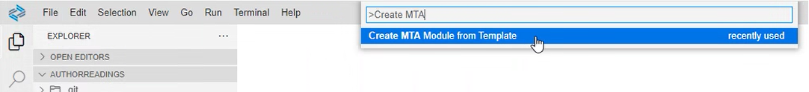

# Develop the Core of the User Interface with SAP Fiori Elements

After you defined the domain model and the business logic of the **Poetry Slams** application with the SAP Cloud Application Programming Model, you now add the user interface of the **Poetry Slams** application with SAP Fiori elements. 

## Use the SAP Fiori Element Application Wizard
1. To start the wizard, search for *Create MTA Module from Template* in the **Command Palette**.

   

2. Select the *SAP Fiori generator* module template. 
3. Select *List Report Page*.
4. Select the data source and the OData service as follows:
   - **Data source**: Use a Local CAP Project
   - Choose your CAP project: partner-reference-application
   - **OData Service**: `PoetrySlamService (Node.js)`
5. Select the main entity from the list:
   - **Main entity**: PoetrySlams
   - **Navigation entity**: None
   - **Automatically add table columns**: Yes
6. Add further project attributes:
   - **Module name**: `poetryslams`
   - **Application title**: `Poetry Slams`
   - **Application namespace**: leave empty
   - **Description**: `Application to create and manage poetry slams`
   - **Table Type**: `Responsive`
   - **Use Virtual Endpoints for Local Preview**: Yes
   - **Enable TypeScript**: No
   - **Add deployment configuration**: Yes
   - **Add Fiori Launchpad Configuration**: Yes
   - **Configure Advanced Options**: No
7. Select **Cloud Foundry** as target of the deployment configuration. 
8. For now, the destination name is set to *None* because you configure it in a later step of this tutorial. 
9. Enter information on the SAP Fiori launchpad configuration:
   - **Semantic Object**: `poetryslams`
   - **Action**: `display`
   - **Title**: `Poetry Slams`
   - **Subtitle** (optional): `Manage Poetry Slams`
10. Choose **Finish**. The wizard creates the */app* folder that contains all files related to the user interface.

## Fine-Tune the User Interface

Copy the following files into your project:
- [`app/poetryslams/annotations.cds`](../../../multi-tenant/app/poetryslams/annotations.cds): Configure the annotations to change the appearance of UI elements.
- [`app/poetryslams/webapp/manifest.json`](../../../multi-tenant/app/poetryslams/webapp/manifest.json): Define the information about the application, such as application names, routes, navigations, and so on.

### Using Different User Interface Pages

The [manifest.json](../../../multi-tenant/app/poetryslams/webapp/manifest.json) file of the **Poetry Slams** app defines a poetry slams list report (*PoetrySlamsList*), a poetry slams object page (*PoetrySlamsObjectPage*), and a bookings object page (*PoetrySlams_visitsObjectPage*). It specifies the navigation between the pages in the **routing** section.

The *PoetrySlams_visitsObjectPage* shouldn't opened when you create a booking in the poetry slams object page. To prevent this, the [*inline* creation mode](https://sapui5.hana.ondemand.com/sdk/#/topic/cfb04f0c58e7409992feb4c91aa9410b) is set in the [manifest.json](../../../multi-tenant/app/poetryslams/webapp/manifest.json) file.

```json
    "controlConfiguration": {
        "visits/@com.sap.vocabularies.UI.v1.LineItem#VisitorData": {
            "tableSettings": {
                "creationMode": {
                    "createAtEnd": true,
                    "name": "Inline"
                }
            }
        }
    }
```

Since the bookings object page is read-only, the update is hidden for the *visits* entity in the [annotations.cds](../../../multi-tenant/app/poetryslams/annotations.cds) file.

```cds
annotate service.Visits with @(
UI : {
    UpdateHidden   : true
});  
```

### Enabling Auto-Refresh when Testing Your Development

Copy the content of the [*ui5.yaml*](../../../multi-tenant/app/poetryslams/ui5.yaml) file. It contains a configuration for the `server middleware` that enables the auto-update of UI-changes when testing locally.

### Annotation Examples

| Functionality                                                                                      | Description                                                                                               | Example       |
| ---------                                                                                          | -------------                                                                                             | ------------- |
| [Semantic Key](https://sapui5.hana.ondemand.com/sdk/#/topic/aa2793cd877a4ecebc35d335920ee145) | Display the editing status of a column in the list report                                                 | [annotations.cds > service.PoetrySlams](../../../multi-tenant/app/poetryslams/annotations.cds) |
| [Side Effects](https://sapui5.hana.ondemand.com/sdk/#/topic/18b17bdd49d1436fa9172cbb01e26544.html) | Reload data, permissions, or messages, or trigger determine actions based on data changes in UI scenarios | [annotations.cds > service.Visits](../../../multi-tenant/app/poetryslams/annotations.cds) |
| [Value List](https://sapui5.hana.ondemand.com/sdk/#/topic/16d43eb0472c4d5a9439ca1bf92c915d.html)   | Enable the selection of a value in a column with the help of a value list                                 | [annotations.cds > service.Visits](../../../multi-tenant/app/poetryslams/annotations.cds) |

### Sandbox Environment for the SAP Fiori Launchpad
The following changes are required:

1. Add the [flpSandbox.html](../../../multi-tenant/app/flpSandbox.html) file into the *app* folder.

2. Create a [util](../../../multi-tenant/app/util) folder in the *app* folder.

3. Copy the [setContent.js](../../../multi-tenant/app/util/setContent.js) file into the newly created *util* folder.

4. Copy the [setLaunchpadShellConfig.js](../../../multi-tenant/app/util/setLaunchpadShellConfig.js) file into the *util* folder.

### Dynamic Tiles

The *indicatorDataSource* parameter is added to the [manifest.json](../../../multi-tenant/app/poetryslams/webapp/manifest.json) file.

```json
  "crossNavigation": {
    "inbounds": {
      "poetryslams-display": {
        "indicatorDataSource": {
          "dataSource": "mainService",
          "path": "PoetrySlams/$count?$filter=status_code%20eq%202",
          "refresh": 60
        }
      }
    }
  }
```

### Autoload Data
Go to the [manifest.json](../../../multi-tenant/app/poetryslams/webapp/manifest.json) here the following parameters are added for auto loading data.

```json
{
    "sap.ui5": {
        "routing": {
            "targets": {
                "PoetrySlamsList": {
                    "options": {
                        "settings": {
                            "initialLoad": true
                        }
                    }
                }
            }
        }
    }
}
```

### Color Coding

To implement a color coding system for specific columns on the user interface, a hidden column named `statusCriticality` that contains color coding information is added. Note that the column isn't part of the database model. It's only added in the service definition and filled dynamically when the entity is read. You can find the required parts in these locations:

- Field definition in [poetrySlamService.cds](../../../multi-tenant/srv/poetryslam/poetrySlamService.cds).
- Logic to fill it in [poetrySlamServicePoetrySlamsImplementation.js](../../../multi-tenant/srv/poetryslam/poetrySlamServicePoetrySlamsImplementation.js):
    ```javascript
    for (const poetrySlam of convertToArray(data)) {
        const status = poetrySlam.status?.code || poetrySlam.status_code;
        // Set status colour code
        switch (status) {
            case codes.poetrySlamStatusCode.inPreparation:
            poetrySlam.statusCriticality = codes.color.grey; // New poetry slams are grey
            break;
            case codes.poetrySlamStatusCode.published:
            poetrySlam.statusCriticality = codes.color.green; // Published poetry slams are green
            break;
            case codes.poetrySlamStatusCode.booked:
            poetrySlam.statusCriticality = codes.color.yellow; // Fully booked poetry slams are yellow
            break;
            case codes.poetrySlamStatusCode.canceled:
            poetrySlam.statusCriticality = codes.color.red; // Canceled poetry slams are red
            break;
            default:
            poetrySlam.statusCriticality = null;
        }
    }
    ```
- `convertToArray` helper function to convert an object or array to an array in [entityCalculations.js](../../../multi-tenant/srv/lib/entityCalculations.js).
- Entries in the i18n files to set the column headers.
- An entry in the [annotations.cds](../../../multi-tenant/app/poetryslams/annotations.cds) to use the field on the user interface.

## Draft Concept
The SAP Cloud Application Programming Model with SAP Fiori elements stack supports a **Draft Concept** out of the box. This enables users to store inconsistent data without having to publish them to other users.

# Conclusion

You have successfully developed the user interface of the application and are ready to [fine-tune the application by defining authorizations and adding the second application named *Visitors*](./1.4-Develop-Core-Finetuning.md) to your application.
