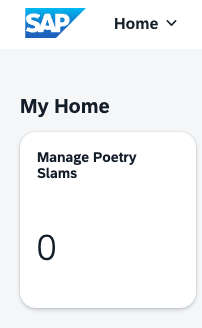

# Fine-Tune the Business Solution with Translation and Authorization

After you defined the domain model, the business logic, and the user interface of the **Poetry Slams** application, you now learn how to add translation and role-based authorizations. You also add the second application called *Visitors* to the business solution and enable the navigation between the two applications.

## Add Translations

Translations of UI labels and texts are stored in properties-files in i18n-folders.

Copy the [domain model-i18n files](../../../multi-tenant/db/i18n), [service model and message-i18n files](../../../multi-tenant/srv/i18n), [web application texts](../../../multi-tenant/app/poetryslams/webapp/i18n), and [web application texts for the manifest](../../../multi-tenant/app/poetryslams/i18n) into your project.

## Add Authentication and Role-Based Authorization
First, define the *Roles* as part of the application definition concept. For the **Poetry Slam Manager** application, two roles are defined: *PoetrySlamManager* and *PoetrySlamVisitor*.

Authorization is always defined at the service level. In this application, it's defined at the level of the */srv/poetryslam/poetrySlamService.cds* file. For better readability, separate the authorization definitions from the service definitions by creating a new file named */srv/poetryslam/poetrySlamServiceAuthorizations.cds*. This file contains all authorization-relevant model parts. Copy the content from the example implementation [srv/poetryslam/poetrySlamServiceAuthorizations.cds](../../../multi-tenant/srv/poetryslam/poetrySlamServiceAuthorizations.cds). Enhance the [/srv/services.cds](../../../multi-tenant/srv/services.cds) file with the reference to the Poetry Slam service authorizations:

```cds
using from './poetryslam/poetrySlamServiceAuthorizations';
```

The wizard created all runtime-relevant security settings of our application. It generated the [xs-security.json](../../../multi-tenant/xs-security.json) file. Open the generated file and replace it. It defines two roles. 

```json
{
  "scopes": [
    {
      "name": "$XSAPPNAME.PoetrySlamFull",
      "description": "Full Read/Write Access to Poetry Slams"
    },
    {
      "name": "$XSAPPNAME.PoetrySlamRestricted",
      "description": "Restricted Read/Write Access to Poetry Slams"
    },
    {
      "name": "$XSAPPNAME.mtcallback",
      "description": "Subscription via SaaS Registry",
      "grant-as-authority-to-apps": [
        "$XSAPPNAME(application,sap-provisioning,tenant-onboarding)"
      ]
    }
  ],
  "attributes": [],
  "role-templates": [
    {
      "name": "PoetrySlamManagerRole",
      "description": "Full Access to Poetry Slams",
      "scope-references": ["$XSAPPNAME.PoetrySlamFull"],
      "attribute-references": []
    },
    {
      "name": "PoetrySlamVisitorRole",
      "description": "Restricted Access to Poetry Slams for Visitors",
      "scope-references": ["$XSAPPNAME.PoetrySlamRestricted"],
      "attribute-references": []
    }
  ],
  "oauth2-configuration": {
    "credential-types": ["binding-secret"]
  }
}
```

Replace the CDS section in the [package.json](../../../multi-tenant/package.json) file. This tells the CDS framework to use the SAP BTP Security Services Integration library of SAP BTP.

```json
  "cds": {
    "features": {
      "assert_integrity": "db"
    },
    "requires": {
      "db": {
        "kind": "sql"
      },
      "uaa": {
        "kind": "xsuaa"
      },
      "[development]": {
        "db": {
          "kind": "sqlite",
          "credentials": {
            "url": ":memory:"
          }
        }
      },
      "[production]": {
        "multitenancy": true
      },
      "sql": {
        "native_hana_associations": false
      },
      "hana": {
        "deploy-format": "hdbtable"
      },
      "profile": "with-mtx-sidecar"
    }
  }
```
Create the [.cdsrc.json](../../../multi-tenant/.cdsrc.json) file in the root of your project and define users and their roles for local testing. Here's an example how you define three users with names, passwords, and assigned roles: 

```json
{
  "requires": {
    "[development]": {
      "auth": {
        "kind": "mocked",
        "users": {
          "Peter": {
            "password": "welcome",
            "id": "peter",
            "roles": ["PoetrySlamFull", "authenticated-user"]
          },
          "Julie": {
            "password": "welcome",
            "id": "julie",
            "roles": ["PoetrySlamRestricted", "authenticated-user"]
          },
          "Denise": {
            "password": "welcome",
            "id": "denise",
            "roles": ["authenticated-user"]
          },
          "*": true
        }
      }
    }
  }
}
```
Next, add the second application named **Visitors**.

## Add a Second Application

This section explains how to add a second application, **Visitors**, to the business solution and implement navigation between the **Poetry Slams** and **Visitors** applications. 

1. Add a `visitor` service by copying the service definition from [srv/visitor/visitorService.cds](../../../multi-tenant/srv/visitor/visitorService.cds) to a new folder called `visitor` in the `srv` folder of your project.

2. Add the authorizations for the `visitor` service: copy the [srv/visitor/visitorServiceAuthorizations.cds](../../../multi-tenant/srv/visitor/visitorServiceAuthorizations.cds) file.

3. Enhance the [/srv/services.cds](../../../multi-tenant/srv/services.cds) file with the reference to the visitor service and the visitor service authorizations:

    ```cds
    using from './visitor/visitorService';
    using from './visitor/visitorServiceAuthorizations';
    ```

4. Use the SAP Fiori element Application Wizard named *Create MTA Module from Template* in the **Command Palette** to create the `visitors` module. Use the following settings (keep default values for other entries):
   - Choose **SAP Fiori Generator**.
   - Select **List Report Page**.
   - **Data Source**: `Use a Local CAP Project`
   - **OData Service**: `VisitorService (Node.js)`
   - **Main entity**: Visitors
   - **Navigation entity**: None
   - **Module name**: `visitors`
   - **Application title**: `Visitors`
   - **Description**: `Application to create and manage visitors`
   - **Table Type**: `Responsive`
   - **Use Virtual Endpoints for Local Preview**: Yes
   - **Add FLP configuration**: `Yes`
   - **Semantic Object**: `visitors`
   - **Action**: `display`
   - *Title*: `Manage Visitors and Artists`
   - **Subtitle** (optional): `Manage Visitors`

5. Copy the content of the [ui5.yaml](../../../multi-tenant/app/visitors/ui5.yaml) file.

6. Copy the i18n-files with the texts of the *Visitors* UI from the [app/visitors/i18n](../../../multi-tenant/app/visitors/i18n) folder and the [app/visitors/webapp/i18n](../../../multi-tenant/app/visitors/webapp/i18n) folder.

7. Adopt the generated [app/visitors/annotations.cds](../../../multi-tenant/app/visitors/annotations.cds) file to adjust the auto-generated list and object page to your needs. You can either copy the complete file or perform individual adjustments:
   1. Rename the *UI.FieldGroup* from *#GeneratedGroup* to something more meaningful.
   2. Use *Capabilities.InsertRestrictions*, *Capabilities.UpdateRestrictions*, and *Capabilities.DeleteRestrictions* to enable the **Create**, **Edit**, and **Delete** buttons.
   3. Add *HeaderInfo* and *SelectionFields*, as well as additional *UI.FieldGroups* and *Facets*.
   4. Add annotations for associations (in this case, *Visits*).
   5. Add the navigation logic between the **Poetry Slams** and the **Visitors** applications by adding the [intent-based navigation](https://sapui5.hana.ondemand.com/sdk/#/topic/d782acf8bfd74107ad6a04f0361c5f62) of SAP Fiori elements.

      1. Add the navigation from the poetry slams object page of the **Poetry Slams** app to the visitors list of the **Visitors** app by enhancing the [app/poetryslams/annotations.cds](../../../multi-tenant/app/poetryslams/annotations.cds) file. Add the following code to the **Identification** section of the *service.PoetrySlams* annotations.

          ```cds
          {
            $Type         : 'UI.DataFieldForIntentBasedNavigation',
            SemanticObject: 'visitors',
            Action        : 'display',
            Label         : '{i18n>maintainVisitors}'
          }
          ```

      2. Add the navigation from the visits object page of the **Poetry Slams** app to the visitors list of the **Visitors** app by enhancing the [app/poetryslams/annotations.cds](../../../multi-tenant/app/poetryslams/annotations.cds) file. Add the following code to the **UI** section of the *service.PoetrySlams* annotations.

          ```cds
          Identification                : [{
            $Type         : 'UI.DataFieldForIntentBasedNavigation',
            SemanticObject: 'visitors',
            Action        : 'display',
            Label         : '{i18n>maintainVisitor}',
            Mapping       : [{
              $Type                 : 'Common.SemanticObjectMappingType',
              LocalProperty         : visitor_ID,
              SemanticObjectProperty: 'ID'
            }],
          }],
          ```

      3. Add the navigation from the visitors object page of the **Visitors** app to the poetry slams list of the **Poetry Slams** app by enhancing the [app/visitors/annotations.cds](../../../multi-tenant/app/visitors/annotations.cds) file. Add the following code to the **UI** section of the *service.Visitors* annotations.

          ```cds
          Identification                : [{
            $Type         : 'UI.DataFieldForIntentBasedNavigation',
            SemanticObject: 'poetryslams',
            Action        : 'display',
            Label         : '{i18n>maintainPoetrySlams}'
          }],
          ```
   
8. Ensure that both applications ([Poetry Slams](../../../multi-tenant/app/poetryslams) and [Visitors](../../../multi-tenant/app/visitors)) use the value `poetryslammanager` for `service` in the `sap.cloud` section of the [manifest.json](../../../multi-tenant/app/visitors/webapp/manifest.json) file. This value specifies the name under which both UI definitions are stored in the HTML5 repository. This value must be the same for all applications in a solution. In this case, the two applications **Poetry Slams** and **Visitors** make up the solution **Poetry Slam Manager**.
    
    ```json
    "sap.cloud": {
      "service": "poetryslammanager",
      "public": true
    }
    ```

9. Make sure the [app/visitors/webapp/manifest.json](../../../multi-tenant/app/visitors/webapp/manifest.json) file includes the following configurations:
    1. Add the parameter `ID` to the `signature` of the inbound navigation `visitors-display`. This is required to enable the intent-based navigation from the **Poetry Slams** application to the **Visitors** application:
        
        ```json
        "signature": {
          "parameters": {
            "ID": {
              "required": false
            }
          },
          "additionalParameters": "ignored"
        }
        ```
        > Note: `additionalParameters` are not required in this use case and are therefore set to be `ignored`.
    2. Explicitly set the SAPUI5 version of the **Visitors** application:
        
        ```json
        "sap.platform.cf": {
          "ui5VersionNumber": "1.136.15"
        }
        ```

## Test the App

You can now start the web application and test it locally in SAP Business Application Studio:
1. Open a terminal in SAP Business Application Studio. 
2. Run the `npm install` command to ensure all modules are loaded and installed.
3. Use the `cds watch` run command to start the app. A success message indicates that the runtime has started: *A service is listening to port 4004*.
> Note
> In case you see something like "ReferenceError: require is not defined in ES module scope, you can use import instead" please check your package.json and change the type attribute from module to .cjs.

4. To open the test environment, choose **Open in a New Tab** in the pop-up message or select the link `http://localhost:4004` in the terminal. A browser tab opens with the web applications and OData service endpoints. 
5. Now it's time to test the web app: 
    
    1. Select the *flpSandbox.html* web application.

    2. A log-on message appears. Use the test users as listed in the *.cdsrc.json* file, such as `peter` / `welcome`.

    3. The SAP Fiori launchpad with the generated tiles appears. To launch the **Poetry Slams** application, choose **Manage Poetry Slams**.
    
        
6. When you start the application, no data is available. To create sample data for mutable data, such as poetry slams, visitors, and visits, choose **Generate Sample Data**.

# Conclusion

Now that you've added authorizations and created a UI for the **Visitors** app, it's time to finally [test your application locally](./1.5-Guided-Tour%20LOCAL.md).
