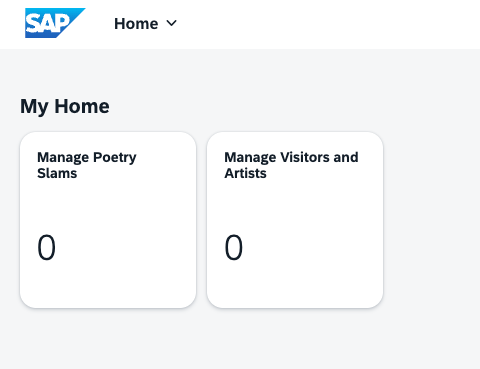
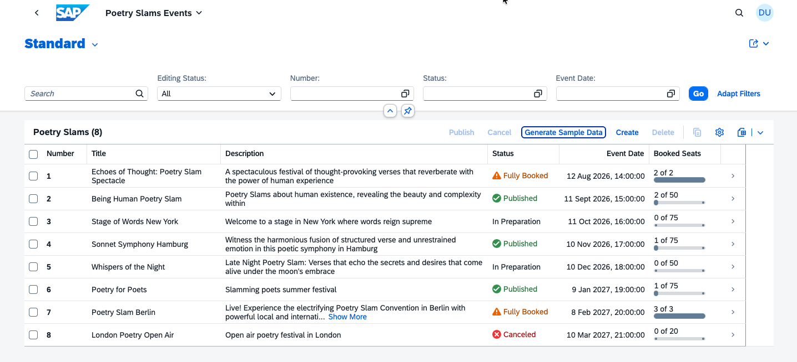
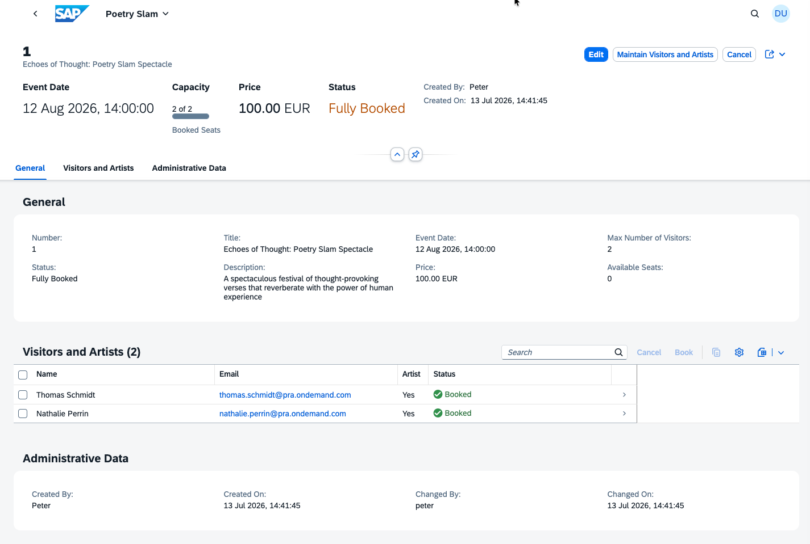
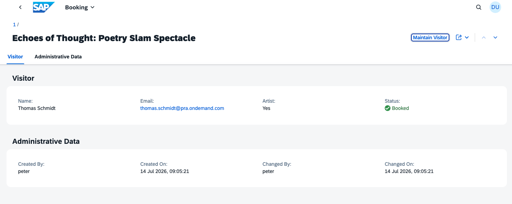
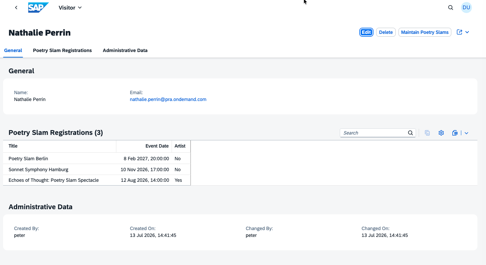

# Go on a Guided Tour to Explore the Capabilities of the Sample Application

Put yourself in the shoes of a poetry slam manager: Imagine it's your job to organize and run poetry slams.

Don't worry. With **Poetry Slam Manager**, a partner application, it's quite simple to organize poetry slams as the app helps you publish them and register artists and guests.

Buckle up and let's take you on a guided tour through the sample solution:

1. Launch your application locally with `cds watch` and log in with the user *peter*. 

2. On the site, you find **Manage Poetry Slams** and **Manage Visitors and Artists**, the partner applications. Open the **Manage Poetry Slams** app.
    
    

3. In the **Manage Poetry Slams** app, an empty list is shown.

4. To create sample data for mutable data, such as poetry slams, visitors, and visits, choose **Generate Sample Data**. Multiple poetry slams are listed: Some are still in preparation while others have already been published. 

    > Note: If you choose **Generate Sample Data** again, the sample data is set to the default values.

    

5. Select one of the poetry slams with status *Published* to see its details.

6. Choose **Edit** and change the description of the poetry slam.

    > Note: In addition, you can also change the title, the event date, the price, and the maximum number of visitors.

7. In the **Visitors and Artists** table, choose **Create**. Select *nathalie.perrin@pra.ondemand.com* from the value help and set the **Artist** indicator. 

    > Note: A new instance of the visit entity is created.
    
8. Save your changes to publish them.

    

9. Select *Nathalie Perrin* in the **Bookings** table to view the details of the individual booking for *Nathalie Perrin*. 
    
    > Note: You navigated to the **Visits** object page of the **Poetry Slams** application.

    

10. Choose **Maintain Visitor** for an overview of all bookings for *Nathalie Perrin*. This includes bookings for all past as well as future poetry slams. 

    > Note: You navigated to the **Manage Visitors and Artists** application of the **Poetry Slam Manager** solution.

    

# Conclusion

This concludes the guided tour. Next, you [prepare the Poetry Slam Manager application for SAP BTP deployment](./1.6-Multi-Tenancy-Develop-Sample-Application.md).
