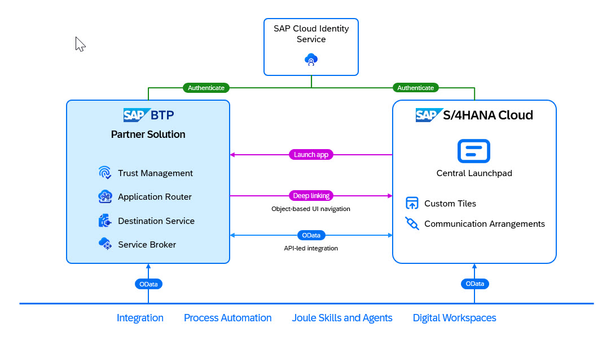

# Configure the Integration with SAP S/4HANA Cloud Public Edition

In this section, you connect a SAP S/4HANA Cloud tenant, the Identity Authentication service tenant of the SAP S/4HANA Cloud Public Edition system (acting as a corporate identity provider), and the SAP BTP customer subaccount with the customer subscription of Poetry Slam Manager.

1. Front-end integration:  

    1. Launch the **Manage Poetry Slams** app and the **Manage Visitors and Artists** app from the SAP Fiori launchpad in the SAP S/4HANA Cloud Public Edition system.  
    2. Launch applications to manage SAP BTP, such as the Identity Authentication service admin application, from the SAP Fiori launchpad in the SAP S/4HANA Cloud Public Edition system.
    3. Navigate from the **Manage Poetry Slams** app to the related enterprise projects in SAP S/4HANA Cloud Public Edition.  
    4. Configure single sign-on for the **Manage Poetry Slams** app and **Manage Visitors and Artists** app in the SAP S/4HANA Cloud Public Edition system, and all SAP BTP admin apps using the same Identity Authentication service tenant as corporate identity provider (IdP).  

2. Back-channel integration: Create and read enterprise projects in SAP S/4HANA Cloud Public Edition from the **Poetry Slam Manager** using OData APIs with principal propagation.

  

## Set Up Single Sign-On for the SAP BTP Application Subscription

Single sign-on has been pre-configured by us for your convenience. You can find more detail in the [Partner Reference Application](https://github.tools.sap/erp4sme/partner-reference-application/blob/main-tutorial/Tutorials/34b-Multi-Tenancy-Provisioning-Connect-S4HC.md#set-up-single-sign-on-for-the-sap-btp-application-subscription). 

## Configure Single Sign-On for SAP S/4HANA Cloud Public Edition

Single sign-on has been pre-configured by us for your convenience. You can find more detail in the [Partner Reference Application](https://github.tools.sap/erp4sme/partner-reference-application/blob/main-tutorial/Tutorials/34b-Multi-Tenancy-Provisioning-Connect-S4HC.md#configure-single-sign-on-for-sap-s4hana-cloud-public-edition).

## Configure SAP S/4HANA Cloud OData Services to Create and Read Enterprise Projects

1. Search for the following OData APIs on the [SAP Business Accelerator Hub](https://api.sap.com/package/SAPS4HANACloud/all) and note down the communication scenario per API:
    - [Enterprise Project](https://api.sap.com/api/API_ENTERPRISE_PROJECT_SRV_0002/overview) (OData v2): Communication scenario: *Enterprise Project Integration* (SAP_COM_0308)
    - [Enterprise Project - Read Project Processing Status](https://api.sap.com/api/ENTPROJECTPROCESSINGSTATUS_0001/overview) (OData v4): Communication scenario: *Enterprise Project - Project Processing Status Integration* (SAP_COM_0725)
    - [Enterprise Project - Read Project Profile](https://api.sap.com/api/ENTPROJECTPROFILECODE_0001/overview) (OData v4): Communication scenario: *Enterprise Project - Project Profile Integration* (SAP_COM_0724)

2. In the SAP S/4HANA Cloud Public Edition system, open the **Communcation Systems** application and create a new communication system that represents the SAP BTP customer subaccount:
    - General Data:  
        | Parameter Name    | Value                                                               | Remark                              |
        | :---------------- | :------------------------------------------------------------------ | :-----------------------------------|
        | *System ID*:      | `HOW{{nnn}}-C1-SYS`                                                | Replace {{nnn}} by your user number |
        | *System Name*:    | `Partner App "Poetry Slam Manager" - Tenant HOW{{nnn}}-C1`          | Replace {{nnn}} by your user number |
    - Technical Data:  
        | Parameter Name        | Value                                                                                 | Remark                                                                                          |
        | :-------------------- | :-------------------------------------------------------------------------------------| :-----------------------------------------------------------------------------------------------|
        | *Host Name*:          | `prahow{{nnn}}-c1.prahow{{nnn}}-runtime-poetry-slams.cfapps.eu10.hana.ondemand.com`   | Hostname of the SAP BTP Application Poetry Slams Tenant URL; replace {{nnn}} by your user number|
        | *Logical System*:     | `PRA{{nnn}}-C1`                                                                       | Replace {{nnn}} by your user number                                                             |
        | *Business System*:    | `PRA{{nnn}}-C1`                                                                       | Replace {{nnn}} by your user number                                                             |
        > Note: The values in the **Technical Data** section are only required to add communication scenarios to the communication systems that include outbound communication services.  
        > Outbound communication is not needed to integrate SAP S/4HANA Cloud Public Edition with SAP BTP. The outbound communication services can be deactivated later.  
        > While the **Logical System** can be set to `DUMMY`, the **Business System** is set to the `Hostname of the SAP BTP Application Poetry Slams Tenant URL`. It needs to be distinct for the SAP S/4HANA Cloud Public Edition system.

3. Create a communication user for inbound communication to the communication system in the **Users for Inbound Communication** section:

    | Parameter Name    | Value                                                                  | Remark                             |
    | :---------------- | :--------------------------------------------------------------------- | :--------------------------------- |
    | *User Name*:      | `HOW{{nnn}}-C1-USR`                                                    | Replace {{nnn}} by your user number|
    | *Description*:    | `Partner App "Poetry Slam Manager" - User for Tenant HOW{{nnn}}-C1`    | Replace {{nnn}} by your user number|
    | *Password*:       | Choose a secure password.                                              |                                    |

    > Note: Save the **User Name** and **Password**. They are used for the SAP BTP destination configuration later.

4. Open the **Communication Arrangements** application and create a new communication arrangement for each communication scenario listed below:

    | Parameter Name                                    | Value                                                                                                                                               |
    | :------------------------------------------------ | :-------------------------------------------------------------------------------------------------------------------------------------------------- |
    | *Arrangement Name*:                               | Arrangement name; combine your user with the scenario name, for example, `HOW{{nnn}}-C1 - Enterprise Projects` (replace {{nnn}} by your user number)|
    | *Communication System*:                           | Select the communication system you've created above                                                                                                       |             
    | *Inbound Communication - User Name*:              | Select the user you've created above                                                                                                                       |
    | *Inbound Communication - Authentication Method*:  | `User ID and Password`                                                                                                                              |
    > Note: You need to create the following communication arrangements for the communication system above:  
    >-  *Communication Arrangement* **Poetry Slam Manager - Project** for *Communication Scenario* **SAP_COM_0308**  
    >-  *Communication Arrangement* **Poetry Slam Manager - Project Profile** for *Communication Scenario* **SAP_COM_0724**  
    >-  *Communication Arrangement* **Poetry Slam Manager - Project Status** for *Communication Scenario* **SAP_COM_0725**  

You can now consume the OData service using the technical user and basic authentication (user/password).

## Configure OAuth Authentication for OData Services

For these exercises, we are using basic authentication. For more information on how to setup OAuth SAML bearer, refer to our [Partner Reference Application](https://github.com/SAP-samples/partner-reference-application/blob/main/Tutorials/34b-Multi-Tenancy-Provisioning-Connect-S4HC.md#configure-oauth-authentication-for-odata-services)).

## Set Up Destinations to Connect the SAP BTP Application to SAP S/4HANA Cloud Public Edition

In this section, three destinations are created to access SAP S/4HANA Cloud OData services:
- **s4hc** to consume SAP S/4HANA Cloud OData services.
- **s4hc-tech-user** to consume SAP S/4HANA Cloud OData services using a technical user with basic authentication.
- **s4hc-url** to provide the SAP S/4HANA Cloud hostname for UI navigations and the name of the SAP S/4HANA Cloud Public Edition system as used by business users.

1. In the SAP BTP customer subaccount, you can create the *s4hc* destination to consume SAP S/4HANA Cloud OData services. Navigate to **Connectivity** in the SAP BTP customer subaccount.

2. Choose **Destinations** and create a new destination with the following field values:

    | Parameter Name            | Value                                                                                         |
    | :------------------------ | :-------------------------------------------------------------------------------------------- |
    | **Name**:                   | s4hc                                                                                        |
    | **Type**:                   | HTTP                                                                                        |
    | **Description**:            | Destination description (for example, `SAP S/4HANA Cloud XXXXXX`)                           |
    | **URL**:                    | **API-URL** of the communication arrangement                                                |
    | **Proxy Type**:             | Internet                                                                                    |
    | **Authentication**:         | BasicAuthentication                                                                         |
    | **User**:                   | **User Name** of the communication user                                                     |
    | **Password**:               | **Password** of the communication user                                                      |

4. Create the *s4hc-tech-user* destination to consume SAP S/4HANA Cloud OData services using a technical communication user.

    In the SAP BTP customer subaccount, navigate to **Connectivity -> Destinations** to create a new destination with the following field values:

    | Parameter Name    | Value                                                                                 |
    | :---------------- | :------------------------------------------------------------------------------------ |
    | **Name**:           | s4hc-tech-user                                                                      |
    | **Type**:           | HTTP                                                                                |
    | **Description**:    | Destination description (for example, `SAP S/4HANA Cloud XXXXXX with technical user`) |
    | **URL**:            | **API-URL** of the communication arrangement                                        |
    | **Proxy Type**:     | Internet                                                                            |
    | **Authentication**: | BasicAuthentication                                                                 |
    | **User**:           | **User Name** of the communication user                                             |
    | **Password**:       | **Password** of the communication user                                              |

6. Create the *s4hc-url* destination to launch SAP S/4HANA Cloud Public Edition apps and to store the name of the SAP S/4HANA Cloud Public Edition system used by business users. 

   In the SAP BTP customer subaccount, navigate to **Connectivity -> Destinations** to create a new destination with the following field values:

    | Parameter Name    | Value                                                                                             |
    | :---------------- | :------------------------------------------------------------------------------------------------ |
    | **Name**:           | s4hc-url                                                                                        |
    | **Type**:           | HTTP                                                                                            |
    | **Description**:    | Destination description (for example, `SAP S/4HANA Cloud XXXXXX`)                                 |
    | **URL**:            | UI endpoint of the SAP S/4HANA Cloud Public Edition system (for example, `https://myXXXXXX.s4hana.ondemand.com`) |
    | **Proxy Type**:     | Internet                                                                                        |
    | **Authentication**: | NoAuthentication                                                                                |

    > Note: The destination URL stores the hostname of the SAP S/4HANA Cloud Public Edition system. By storing the base URL in a destination, you ensure that connecting the SAP BTP web application to the SAP S/4HANA Cloud Public Edition system is a pure configuration task and doesn't require any code changes. 
    
   At runtime, you dynamically assemble the parameterized URL to launch the project planning view of SAP S/4HANA Cloud enterprise projects. You concatenate the base URL with the floorplan-specific path and the object-specific parameters, such as the project ID. The authentication method isn't relevant in this destination, so you choose **NoAuthentication** to keep things simple. Note that this destination can't be used to access any SAP S/4HANA Cloud service directly.
   
    > Note: The destination description is used to store the name of the SAP S/4HANA Cloud Public Edition system used by business users. At runtime, this description is used to refer to the SAP S/4HANA Cloud Public Edition system on the UI of the SAP BTP application.

## Add SAP BTP Applications to the SAP Fiori Launchpad of SAP S/4HANA Cloud

As a last step, the **Poetry Slam Manager** apps and SAP BTP admin apps are added to SAP Fiori launchpad to enable poetry slam managers and system administrators to launch all relevant applications from a single launchpad.

1.  In the SAP S/4HANA Cloud tenant, open the **Custom Tiles** app and add a new custom tile with the following field values:
			
    | Field        | Value                                                                                          | Remark                                |
    | :----------- | :--------------------------------------------------------------------------------------------- | :-------------------------------------|
    | **Title**:     | `Poetry Slams {{nnn}}`                                                                       | Replace {{nnn}} by your user number  |
    | **ID**:        | `HOW{{nnn}}C1`                                                                         | Replace {{nnn}} by your user number  |
    | **Subtitle**:  | `Manage Poetry Slams`                                                                        |                                       |
    | **URL**:       | Enter the **SAP BTP Application Poetry Slams Tenant URL** you noted down in a previous step. |Open the Work Zone Launchpad and copy the like of tile Poetry Slam Events to get the URL|
    | **Icon**:      | Choose an icon, for example, *sap-icon://microphone*.                                        |                                       |
            
2. Choose Assign Catalogs and add the business catalog *Enterprise Projects - Project Financial Controlling(SAP_PS_BC_PROJ_CONTRL_MC)*.
	
3. Choose **Publish**.

4. Open the **App Finder** in your user profile (the User Menu in upper right corner) and search for the **Enterprise Projects - Project Financial Controlling** in list of catalogues on the left side. Select the catalogue and add your Poetry Slam tile (click on “+”) to the app group `Partner Training - Side-by-Side Extensions`.

    > Note: Refresh your browser window if the app is not listed.

5. Repeat the previous steps for the **Manage Visitors and Artists** app. Use the **SAP BTP Application Visitors Tenant URL** as URL.

You can now see the **Manage Poetry Slams** and **Manage Visitors and Artists** apps on SAP Fiori Launchpad in app group *Partner Hands-on Training – Project Management*.

> Note: Typically, customers have SAP S/4HANA Cloud tenants for customizing, test, and productive use. In such a setup, the custom tile is created in the customizing tenant and transported to the test and productive tenants using the software collections. 

## Create Users and Assign Authorizations

The SAP BTP application design relies on business users and authorizations being created and managed in the Cloud ERP solution (in this case, SAP S/4HANA Cloud Public Edition) and the customer identity provider (in this case, Identity Authentication service connected to SAP S/4HANA Cloud Public Edition).
As a general approach, you create users in the ERP solution and the IdP, and then assigned them to the user group that includes the authorization of the partner application users.

# Conclusion

Now it's time to deploy Your application. For this please follow [Sync Point 2, 3 and 4](./../../README.md).
