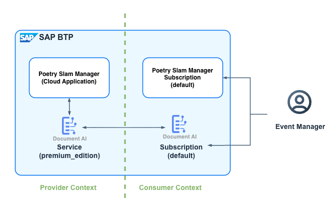

# Intelligent Document Processing using SAP Document AI

Imagine you're a poetry slam manager using a specialized application to organize events. You can maintain additional visitors and visits to a published event seamlessly. SAP Document AI supports you by intelligently extracting and mapping data from an uploaded guest list and associating it with visitors and visits.

For scanning and analyzing data from documents, the [SAP Document AI](https://help.sap.com/docs/document-ai/sap-document-ai/what-is-sap-document-ai) is used.

SAP Document AI offers two interfaces for document processing:

1. [SAP Document AI basic UI and REST APIs](https://help.sap.com/docs/document-ai/sap-document-ai/sap-document-ai-version-1-base-edition-and-premium-edition): A simplified interface for business users to quickly upload and process documents. It provides an easy-to-use platform for viewing extracted data with minimal configuration.

2. [SAP Document AI workspace and ODATA V4 APIs](https://help.sap.com/docs/document-ai/sap-document-ai/sap-document-ai-version-2-embedded-edition-and-premium-edition): An advanced environment for developers and technical users to build, train, and manage custom document processing models. It allows for schema creation, field mapping, and integration with external systems, offering full control over the document processing pipeline.

Setting up SAP Document AI workspace for document processing involves several components:

1. The **SAP Document AI** service with the *premium_edition* plan operates in the SAP BTP provider subaccount and is used to securely process documents using AI.
2. The **SAP Document AI** application subscription with the *default* plan operates in the SAP BTP consumer subaccount and is used to configure the extraction schema and review the processed documents specific to that consumer.

## Guest List Document Processing Workflow

<p align="center">
    
</p>

1. **Upload**: Users upload a guest list document using the **Poetry Slam Manager** application, which forwards it to SAP Document AI for processing.
2. **Extract**: SAP Document AI uses the `PSM_EXTRACT_VISITORS` schema to extract guest details, such as names, emails, and artist indicators.
3. **Poll**: The **Poetry Slam Manager** application checks the extraction status (`Review Needed`) and generates a link that opens the document directly in the SAP Document AI application for review.
4. **Review**: Users review and confirm the extracted data in the SAP Document AI application.
5. **Callback**: After confirmation, SAP Document AI notifies the **Poetry Slam Manager** application through the configured outbound channel.
6. **Create**: The confirmed data is retrieved and used to automatically create guest list entries in the **Poetry Slam Manager** application.

## Prerequisites

- The API OData service of the **Poetry Slam Manager** must be accessible from the SAP Document AI workspace to configure the outbound channel. For information on how to make the OData services accessible to other applications, see [Create an API Service for Remote Integrations without Draft Handling](./5.2-Multi-Tenancy-Features-API-Service.md).

- You have a SAP Cloud Identity Services tenant. For more information, see [Tenants](https://help.sap.com/docs/cloud-identity-services/cloud-identity-services/tenant-model-and-licensing?version=Cloud#getting-a-tenant) on SAP Help Portal.

## Application Enablement

1. Enhance the **Poetry Slam Manager** domain model in file [poetrySlamManagerModel.cds](../../../Document-AI/db/poetrySlamManagerModel.cds). Add a new `documentAIDocID` field to the `PoetrySlams` entity to store the reference to the processed document in SAP Document AI, and add its label annotation.

    ```cds
    extend PoetrySlams with {
        documentAIDocID : UUID;
    }

    annotate PoetrySlams with {
        documentAIDocID @title: '{i18n>documentAIDocID}' @readonly;
    }
    ```

    Add the label to the [db/i18n/i18n.properties](../../../Document-AI/db/i18n/i18n.properties) file:

    ```properties
    documentAIDocID = Document AI Document ID
    ```

  > [!NOTE]
  > The [db/i18n/i18n_de.properties](../../../Document-AIs/db/i18n/i18n_de.properties) file with the German texts is available, too. You can adopt them accordingly.

2. Enhance the poetry slam service definition [poetrySlamService.cds](../../../Document-AI/srv/poetryslam/poetrySlamService.cds). Add the bound action `uploadGuestList` to the `PoetrySlams` entity. This action receives the document file content from the UI, sends it to SAP Document AI for extraction, and returns the URL to the document in the SAP Document AI workspace.

    ```cds
    // Action: Upload guest list to SAP Document AI
    action uploadGuestList(fileContent: LargeBinary,
                           fileName: String(255),
                           mimeType: String(100)) returns String;
    ```

3. Add the API to access the SAP Document AI.

    1. The [SAP Document AI OData V4 APIs](https://api.sap.com/api/document_information_extraction_api_v2/overview) are available on SAP Business Accelerator Hub. Download the metadata file (.json file) from the **API Specification** section.

    2. Rename the downloaded metadata file to *DOCUMENTAIAPI.json*.

    3. Upload the [DOCUMENTAIAPI.json](../../../Document-AI/external_resources/DOCUMENTAIAPI.json) file to the [external_resources folder](../../../Document-AI/external_resources).

    4. Add `@sap-cloud-sdk/openapi-generator` and `@sap-cloud-sdk/openapi` to the [package.json](../../../Document-AI/package.json) dependencies:

        ```shell
        npm add -D @sap-cloud-sdk/openapi-generator
        npm add @sap-cloud-sdk/openapi
        ```

    5. Enhance the npm build script in the [package.json](../../../Document-AI/package.json) file of your project to generate the API that is required to access SAP Document AI.

        ```json
        "scripts": {
            "prebuild": "openapi-generator --input external_resources/DOCUMENTAIAPI.json --outputDir srv/external --transpile true --overwrite --skipValidation"
        }
        ```

    6. Ensure the following configuration is added to the package.json file to increase the body parser limit for handling large payloads. For more information, refer to the [capire documentation](https://cap.cloud.sap/docs/releases/2024/jul24#request-body-limits).

        ```json
        "cds": {
            "server": {
                "body_parser": {
                "limit": "10mb"
                }
            }
        }
        ````

4. Copy the [srv/lib/documentAI.js](../../../Document-AI/srv/lib/documentAI.js) file to your project. This file implements the `DocumentAI` class that wraps the SAP Document AI API. It handles file uploads, schema lookups, schema execution, polling for extraction status, and entity parsing.

>[!NOTE]
> Set the environment variables `DOCUMENT_AI_POLL_INTERVAL_MS` (default: 2000) and `DOCUMENT_AI_POLL_TIMEOUT_MS` (default: 30000) to control the polling behavior.

5. Copy the [srv/poetryslam/poetrySlamServiceDocumentAIImplementation.js](../../../Document-AI/srv/poetryslam/poetrySlamServiceDocumentAIImplementation.js) file to your project. It contains the action handler for `uploadGuestList`. The handler validates that the poetry slam is in **Published** status, calls the `DocumentAI` class to extract the guest list from the uploaded file, stores the returned document ID on the poetry slam record, and returns the URL to the document in the SAP Document AI workspace.

>[!NOTE]
>The `uploadGuestList` action requires the poetry slam to be in **Published** status. Attempting to upload a guest list for a poetry slam in any other status results in an error.

6. Replace the [srv/lib/serviceCredentials.js](../../../Document-AI/srv/lib/serviceCredentials.js) file to your project. The class leverages the `serviceCredentials` library for credential and token management, which includes tenant-aware token caching to support multitenancy efficiently.

7. Register the SAP Document AI handler in the main service implementation [poetrySlamServiceImplementation.js](../../../Document-AI/srv/poetryslam/poetrySlamServiceImplementation.js).

    ```js
    const documentAIHandler = require('./poetrySlamServiceDocumentAIImplementation');

    module.exports = class extends cds.ApplicationService {
        async init() {
            // ...
            await documentAIHandler(this); // Forward handler for Document AI
            // ...
        }
    };
    ```

8. Add the i18n messages for error and status messages to [srv/i18n/messages.properties](../../../Document-AI/srv/i18n/messages.properties):

    ```properties
    NOT_ENOUGH_SEATS                = Not enough free seats. The guest list has {0} more entries than available seats.
    UPLOAD_GUEST_LIST_UPDATE_FAILED = Failed to update the poetry slam after guest list upload.
    ```


> [!NOTE]
>The [srv/i18n/messages_de.properties](../../../Document-AI/srv/i18n/messages_de.properties) file with the German texts is available, too. You can adopt them accordingly.
>
>If a guest list document contains more guests than available seats, the callback returns the `NOT_ENOUGH_SEATS` error. The number of missing seats is reported in the error message.

9. How to add the custom actions in the **Poetry Slams** application.

    1. Include the **sap.ui.unified** library in the [manifest.json](../../../Document-AI/app/poetryslams/webapp/manifest.json) file to enable the use of the FilePicker control. This control is essential for allowing users to upload files seamlessly within the application.

    2. Add the **Upload Guest List** custom action button to the object page toolbar in the [manifest.json](../../../Document-AI/app/poetryslams/webapp/manifest.json) file. The button triggers a file picker for uploading a document to SAP Document AI.

        ```json
        "UploadGuestList": {
            "press": "poetryslams.ext.customActions.uploadGuestList",
            "visible": "{= ${ui>/editMode} !== 'Editable'}",
            "enabled": "{= ${ui>/editMode} !== 'Editable'}",
            "text": "{i18n>uploadGuestList}"
        }
        ```

    3. Create the folder **ext** under [app/poetryslams/webapp/](../../../Document-AI/app/poetryslams/webapp/ext/) and copy the file [customActions.js](../../../Document-AI/app/poetryslams/webapp/ext/customActions.js) with the `uploadGuestList` function into it. The function opens a file picker limited to PDF and Excel files (`.pdf`, `.xlsx`, `.xls`), reads the selected file as base64-encoded content, calls the OData action named `uploadGuestList`, and shows a success dialog with a link to open the document directly in the SAP Document AI workspace.

    4. Add the UI texts for the new button to [app/poetryslams/webapp/i18n/i18n.properties](../../../Document-AI/app/poetryslams/webapp/i18n/i18n.properties):

        ```properties
        uploadGuestList         = Upload Guest List
        upload                  = Upload
        selectFile              = Select a PDF or Excel file...
        selectFileFirst         = Please select a file first.
        cancel                  = Cancel
        mimeTypeNotFound        = The selected file does not have a valid MIME type. Please select a valid PDF or Excel file.
        docExtractionFailed     = Document extraction failed. Please try again.
        docExtractionStarted    = Document extraction started...
        docExtractionCompleted  = Document extraction completed. Kindly review the extraction and confirm in SAP Document AI.
        openDocument            = Open Document
        readFileFailed          = Failed to read the file. Please try again.
        ```

> [!NOTE]
> The [app/poetryslams/webapp/i18n/i18n_de.properties](../../../Document-AI/app/poetryslams/webapp/i18n/i18n_de.properties) file with the German texts is available, too. You can adopt them accordingly.

10. Expose the `documentAIDocID` field in the [Poetry Slam Manager API](../../../Document-AI/srv/api/poetrySlamManagerAPI.cds) and add the `documentAICallback` unbound action. The callback action is called by the SAP Document AI service once the user confirms the extraction results, and triggers the creation of visitors and visits. Configure the implementation class for the service to handle the logic for the `documentAICallback` action.

    ```cds
    service PoetrySlamManagerAPIService @(
    path: 'poetryslammanagerapi',
    impl: './poetrySlamManagerAPIImplementation.js'
    ) {

    // ...

    // Expose documentAIDocID in the PoetrySlams projection
    extend PoetrySlams with columns {
        documentAIDocID
    };

    // Unbound action for Document AI callback
    action documentAICallback( NotificationTargetStatus: String(100),
                               AdditionalInfo: String(50000),
                               NotificationObjectType: String(100),
                               NotificationType: String(1),
                               NotificationObjectId: UUID,
                               DocumentResult: LargeString) returns String;
    }
    ```

11. Copy the [srv/api/poetrySlamManagerAPIImplementation.js](../../../Document-AI/srv/api/poetrySlamManagerAPIImplementation.js) file with the handler for the `documentAICallback` action. This handler looks up the poetry slam by `documentAIDocID`, validates seat availability, reads the extracted entities from SAP Document AI, and creates the corresponding visitor and visit records.

12. Create a [server.js](../../../Document-AI/server.js) file in the root folder of your project and copy the content. This file bootstraps the Express server with cross-site request forgery (CSRF) protection for the Document AI callback endpoint, which is called by the SAP Document AI service once the user confirms the extraction results.

> [!NOTE]
> For more information on server bootstrap and Express server configuration, refer to the [CAP Node.js](https://cap.cloud.sap/docs/node.js/cds-server) documentation about cds.server.

13. Add `csrf-csrf` and `cookie-parser` to the [package.json](../../../Document-AI/package.json) dependencies:

    ```shell
    npm add csrf-csrf cookie-parser
    ```

> [!NOTE]
> To receive information through outbound channels, your target system should support CSRF tokens. For details, see [Generate CSRF Token for Receiving Notifications](https://help.sap.com/docs/document-ai/sap-document-ai/get-csrf-token).

14. Add the **SAP Document AI** service as a resource in the [mta.yaml](../../../Document-AI/mta.yaml) file.

    ```yaml
    resources:
        # SAP Document AI (Document Information Extraction)
        - name: poetry-slams-document-ai
          type: org.cloudfoundry.managed-service
          parameters:
            service: sap-document-information-extraction
            service-plan: premium_edition
    ```

15. Add the resource as a dependency in the service module and the MTX module.

    ```yaml
    modules:
        # Service module
        - name: poetry-slams-srv
          requires:
            - name: poetry-slams-document-ai

        # MTX module
        - name: poetry-slams-mtx
          requires:
            - name: poetry-slams-document-ai
    ```

16. Register the service in the multi-tenant environment [mtx/sidecar/package.json](../../../Document-AI/mtx/sidecar/package.json) file. For more information, see [SaaS Registry Dependencies](https://cap.cloud.sap/docs/guides/multitenancy/#saas-dependencies).

    ```yaml
        "cds": {
        ...
            "requires": {
                ...  
                "poetry-slams-document-ai": {
                    "vcap": {
                        "label": "sap-document-information-extraction"
                    },
                    "subscriptionDependency": {
                        "uaa": "xsappname"
                    }
                }
                ...
            }
        }
        ```

17. Run the following command in your project root folder to install the required npm modules.

    ```shell
    npm install
    ```

18. Build and deploy the application by following [Sync Point 2, 3 and 4](./../../README.md).

19. Upgrade the consumer tenants by following these steps:using [`cds-mtx upgrade`](https://cap.cloud.sap/docs/guides/multitenancy/#update-database-schema) in the root of your project.
    - Open your Provider Subaccount.
    - Navigate to **Security** -> **Role Collections** and assign the Role Collection **Subscription Management Dashboard Administrator** to your Business User.
    - Navigate **Instances and Subscriptions** and launch the **SaaS Provisioning Service** application.
    - Update your consumer tenant.

> [!NOTE]
> Upgrading is necessary because adding the SAP Document AI service as a new subscription dependency requires aligning the container and tenant-specific settings. This ensures that the SaaS provisioning framework can properly register and integrate the new service, enabling its functionality for consumer tenants.

## SAP BTP Configuration and Deployment

### Provider Subaccount Setup

1. Open the SAP BTP cockpit of the provider subaccount and add the required entitlements:

   - *SAP Document AI* with the *premium_edition* plan to access the SAP Document AI service.

### Consumer Subaccount Setup

1. In the SAP BTP cockpit of the consumer subaccount, under **Entitlements**, choose **Edit** and **Add Service Plans** to add the *document-information-extraction-application-ias* service with the *default* plan and *document-information-extraction-application* service with the *premium_edition* plan. Save your changes.

2. Under **Instances and Subscriptions** of the consumer subaccounts, create a *SAP Document AI* subscription for the *default* plan.

3. SAP Document AI workspace uses policies on the SAP Cloud Identity Service to handle authorizations. Contact your SAP trainer to assign the Document AI admin authorizations according the following steps:

    1. Access the **SAP Cloud Identity Service** and navigate to **Application & Resources**.

    2. Open the application “SAP Document AI prod-eu10 (HOW-<nnn> Customer 1)”.
    
    3. On sheet **Authorization Policies**: Assign the Policy “Admin” to your user “PRAHOW-<nnn>”.

    4. On sheet **Trust** navigate to **Conditional Authentication** > **Identity Federation** and set the indicator “Use Identity Authentication user store”.

4. Open the SAP Document AI application to load the basic UI. If you encounter a **Permission Denied** popup, it indicates that you lack the required [role collections](https://help.sap.com/docs/document-ai/sap-document-ai/role-collections) to access the Basic UI. However, for this task, we're working directly in the SAP Document AI workspace. Follow the instruction on the popup to navigate to the SAP Document AI workspace.

> [!NOTE]
> If you have access to the basic UI, toggle the **Workspace** switch at the top of the screen from OFF to ON.

6. In the SAP Document AI workspace, import the provided schema file to create a custom schema named `PSM_EXTRACT_VISITORS`, designed specifically to extract guest list details such as names, emails, and artist indicators.

    1. In **Schemas**, choose **Import** and upload the [schema](./document-ai/SCHEMA-PSM_EXTRACT_VISITORS.json).

    2. Search for the imported schema in the list of schemas and open it. (By default, the schema is called `PSM_EXTRACT_VISITORS`).

    3. Open the desired version of the schema.

    4. Choose **Activate** to activate the schema.

    You can also manually create the schema that extracts the fields listed in the table from the document. For more information, see [Create Schema](https://help.sap.com/docs/document-ai/sap-document-ai/create-schema-workspace).

     | Field Name      | Type    | Description                               |
     | --------------- | ------- | ----------------------------------------- |
     | name            | string  | Full name of the visitor or artist        |
     | email           | string  | Email address (used as unique identifier) |
     | artistIndicator | boolean | Whether the person is an artist           |

> [!NOTE]
> The schema name `PSM_EXTRACT_VISITORS` is the default value used by the `DocumentAI` class. Ensure that at least one schema version is set to *Active* status.

7. Create a destination to access SAP Document AI in the consumer subaccount.

    1. Get the information from the service key of the service broker instance named `psm-sb-sub1-full`:

        1. In the SAP BTP cockpit of the consumer subaccount, navigate to **Services > Instances and Subscriptions**.
        2. View the credentials of the service broker instance named `psm-sb-sub1-full`.
        3. For the *ServiceBrokerEndpoint*, get the *URL* of *psm-servicebroker* in the *endpoints* section and add `/odata/v4/poetryslammanagerapi/documentAICallback`.
        4. Get the *ServiceBrokerClientID* and *ServiceBrokerClientSecret* from the *uaa* section.
        5. For the *ServiceBrokerTokenServiceURL*, get the *URL* of the *uaa* section and add `/oauth/token`.

    2. Create the destination using the parameters from the previous step:

        | Parameter Name              | Value                                                                                 |
        | :-------------------------- | :------------------------------------------------------------------------------------ |
        | *Name*:                     | *psm-doc-ai*                                                                          |
        | *Type*:                     | *HTTP*                                                                                |
        | *Description*:              | Poetry Slams Manager - API for outbound channel for Document AI.                      |
        | *URL*:                      | *ServiceBrokerEndpoint*                                                               |
        | *Proxy Type*:               | *Internet*                                                                            |
        | *Authentication*:           | *OAuth2ClientCredentials*                                                             |
        | *Client Id*:                | *ServiceBrokerClientID*                                                               |
        | *Client secret*:            | *ServiceBrokerClientSecret*                                                           |
        | *Token Service URL*:        | *ServiceBrokerTokenServiceURL*                                                        |
        | *Token Service URL Type*:   | *Dedicated*                                                                           |

8. In the SAP Document AI workspace, configure the outbound channel using the destination.

    1. In **Channels**, choose **Create Channel** and provide the following details:
        - Name: *psm-doc-ai-outbound*
        - Channel: *Outbound*
        - Proxy: *Internet*
        - Type: *HTTP*
        - Use SAP BTP Destination: *Yes*
        - Destination: *psm-doc-ai*
        - Response Mode: *Asynchronous*
    2. Choose **Next Step** and **Create**.
    3. Open the *psm-doc-ai-outbound* channel and choose **Activate**.

9. Configure the schema with the outbound channel.

    1. In **Schemas**, open *PSM_EXTRACT_VISITORS*.
    2. Open the active version.
    3. Navigate to the **Outbound Channels** tab.
    4. Under **Outbound Channels for Notifications**, choose **Add**. 
    5. As **Channel**, set *psm-doc-ai-outbound*. As **Document Status**, set *Confirmed*.
    6. Press **Add** and **Confirm**.
    7. Set **Include extraction results for all outbound channels** to **No** and save.

> [!NOTE]
> The outbound channel configuration notifies the application after the document extraction results are confirmed by the user. For more information, see [Channels](https://help.sap.com/docs/document-ai/sap-document-ai/channels).


# A Guided Tour to Explore the Document Processing Feature

Now it's time to take you on a guided tour through the document processing feature of the **Poetry Slam Manager**.

1. Open the SAP BTP cockpit of the consumer subaccount.

2. Open the **Poetry Slams** application.

3. To create sample data for mutable data, such as poetry slams, visitors, and visits, choose **Generate Sample Data**. As a result, a list with several poetry slams is shown.
> [!NOTE]
> If you choose **Generate Sample Data** again, the sample data is set to the default values.

4. Select a published poetry slam event.

5. Choose **Upload Guest List** from the object page toolbar.

> [!NOTE]
> To upload guest lists, users must have the `PoetrySlamFull` role (Poetry Slam Manager role) to access the **Poetry Slams** application.

6. Select a PDF or Excel file that contains the guest list for the event. The file is uploaded to SAP Document AI for extraction. You can use the [Guest_List.pdf](./document-ai/Guest_List.pdf) example file provided with the tutorial.

7. After the upload, a success dialog is shown. Choose **Open Document** to navigate directly to the document in the SAP Document AI workspace.

8. In the SAP Document AI workspace, review the extraction results. Choose **Edit** button to make any necessary adjustments, then choose **Save & Confirm** to save the changes. Finally, choose **Confirm** to finalize and confirm the extracted data.

> [!NOTE]
> To access the SAP Document AI workspace, users must have the appropriate Document AI role collections assigned as described in step 3 of the `Consumer Subaccount Setup` section.

9. Once the document is confirmed, the SAP Document AI service calls the `documentAICallback` endpoint of the **Poetry Slam Manager**. The callback handler reads the extracted entities and creates the corresponding visitor and visit records in the application.

10. Navigate back to the poetry slam in the **Poetry Slam Manager** to verify that the visitors have been created from the extracted guest list data.

# Remarks and Troubleshooting

- If extraction times out (default: 30 seconds), increase the timeout by setting the environment variable `DOCUMENT_AI_POLL_TIMEOUT_MS` in your deployment configuration. Similarly, adjust `DOCUMENT_AI_POLL_INTERVAL_MS` to control how frequently the extraction status is polled.

- The SAP Document AI service processes documents in the provider subaccount. The consumer subaccount subscription is only used for schema management and document review. Ensure the `PSM_EXTRACT_VISITORS` schema is created and has at least one *active* version before uploading documents.

- Entries in the guest list document that do not contain an email address are skipped during entity parsing. Ensure your documents include email addresses for all guests to avoid data loss.

- The Document AI callback endpoint is protected by CSRF. The SAP Document AI service must first issue an HTTP HEAD request to `/odata/v4/poetryslammanagerapi/documentAICallback` to obtain a CSRF token before sending the callback POST request. For more information, see [Generate CSRF Token](https://help.sap.com/docs/document-ai/sap-document-ai/get-csrf-token).

- If you receive a "Permission Denied" dialog when trying to access the SAP Document AI workspace, follow these steps:

    1. Choose the link (here) in "Or click here if you already have access to the SAP Document AI workspace."

    2. Enter your Identity Authentication service email or user name and password to log on.

    3. Verify that the relevant authorization policies have been assigned to your user in the Identity Authentication service admin console. For more information, see [Authorization Policies](https://help.sap.com/docs/document-ai/sap-document-ai/authorization-policies-workspace?locale=en-US&state=PRODUCTION&version=SHIP).
